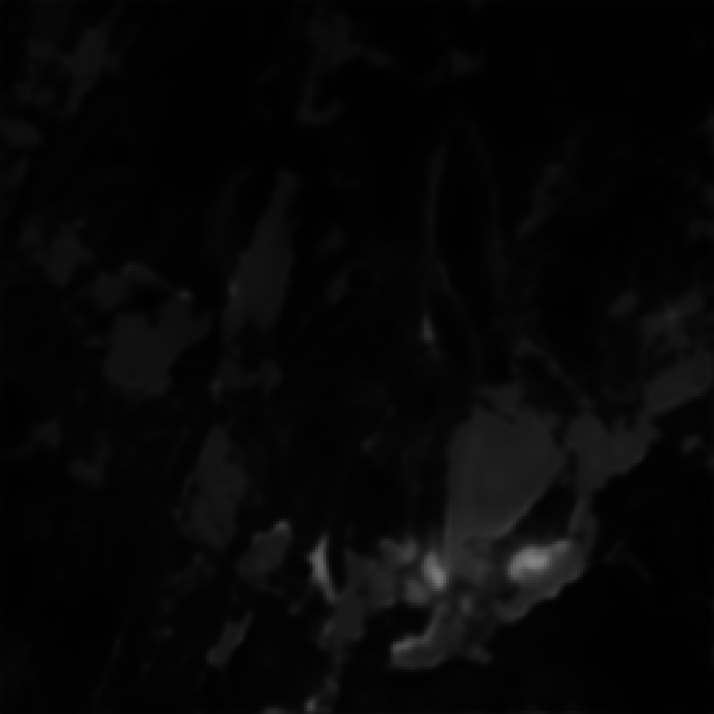
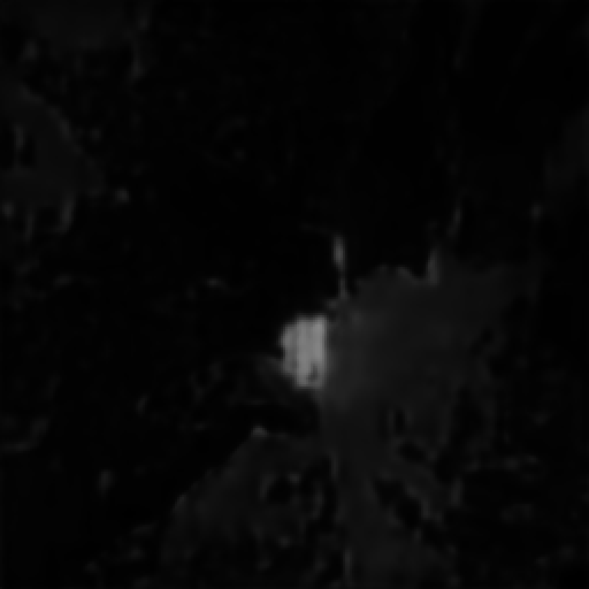
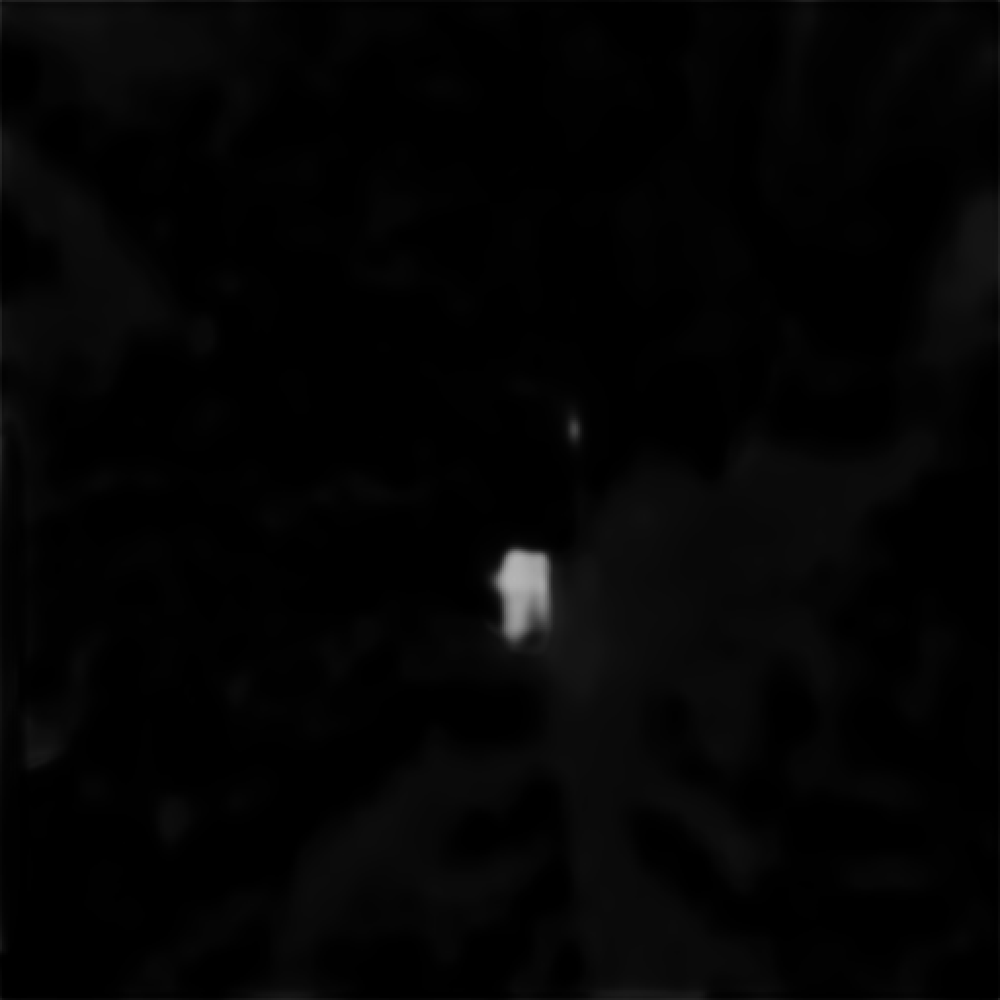

# Semantic Segmentation of Snowcovered Areas in Slovenia Based on Sentinel-2 Imagery

---

This repository includes:
- The abstract of the paper presented at the GIS v Sloveniji 18 conference
- A description of the proposed snow segmentation method, the datasets and the experiments
- Results of the k-fold cross-validation and of testing on an independent test set
- The complete codebase for dataset creation, model training and evaluation
- Trained models and a demo notebook for running inference on Sentinel-2 imagery

---

### Information regarding the paper

- **Title (Slovenian):** Semantična segmentacija zasneženih površin v Sloveniji na osnovi posnetkov Sentinel-2
- **Title (English):** Semantic Segmentation of Snowcovered Areas in Slovenia Based on Sentinel-2 Imagery
- **Authors:** Domen Kavran¹, Mihaela Triglav Čekada², Niko Lukač¹
  - ¹ University of Maribor, Faculty of Electrical Engineering and Computer Science (UM FERI), Maribor, Slovenia
  - ² Geodetic Institute of Slovenia, Ljubljana, Slovenia
- **Published in:** GIS v Sloveniji 18, Pametni prostor, 2026
- **Language:** Slovenian
- **Dataset:** [Global Sentinel-2 Snow Semantic Segmentation Dataset with Dynamic World Labels](https://doi.org/10.5281/zenodo.19482842) (Zenodo)

### Abstract

The paper focuses on semantic segmentation of snow-covered surfaces in Slovenia based on multispectral Sentinel-2 satellite imagery. The proposed semantic segmentation method relies on deep learning models to generate a binary snow map, with the U-Net architecture and the GASSL foundation model evaluated on a custom dataset covering 8,300 areas. The proposed method was tested on satellite imagery of the Martuljek and Prisojnik mountains, where permanent snowfields thrive through whole summer. The results show that using all 13 spectral bands improves semantic segmentation performance, with the GASSL foundation model achieving the highest mean Intersection Over Union (mIoU) of 0.4027.

**Keywords:** semantic segmentation, snow, snowfield, Sentinel-2, deep learning, foundation model

### Proposed method

A multispectral satellite image *I* of size *W × H* with *C* spectral bands is passed to a trained deep learning model *f*θ. The number and order of the bands must match what the model expects.

The model outputs a probability map *P* of the same size as the input. Each value of *P* is the probability that the pixel belongs to the class *snow*. The final binary snow map *Y* is obtained by thresholding *P* with a threshold *τ*, usually set to 0.5:

*P = f*θ*(I)*, &nbsp;&nbsp; *Y*i,j = 1 (snow) if *P*i,j ≥ *τ*, otherwise 0 (no snow)

Any deep learning model that takes a multi-band image and returns a 2D map can be used. If the output size differs from the input size, the output is upscaled or downscaled.

### Datasets

No extensive public dataset for snow recognition on Sentinel-2 data was available, so a custom training dataset and an independent test (control) dataset were created. Both were built with Google Earth Engine.

- **Imagery:**
  - Sentinel-2 Level-1C imagery from the `COPERNICUS/S2_HARMONIZED` collection, with all 13 spectral bands of top-of-atmosphere (TOA) reflectance.
  - TOA was used instead of bottom-of-atmosphere (BOA) surface reflectance, to avoid potential loss of surface information caused by complex atmospheric correction.
  - Only scenes with at most 5 % cloud cover were used.
- **Labels:** Dynamic World land cover labels (`GOOGLE/DYNAMICWORLD/V1`) for the same spatial extent, binarized into snow (1) and no snow (0).

**Training dataset:** 8,300 random locations on the Earth's surface with bounding boxes of different sizes. For each location, a random time window (from 2023 onwards) was given, within which an available Sentinel-2 image was searched for. The dataset is publicly available on [Zenodo](https://doi.org/10.5281/zenodo.19482842).

**Test (control) dataset:** created with almost the same procedure, but over two Slovenian alpine areas where snowfields persist through the whole summer:
- **Martuljek mountains** (Martuljška skupina, 6.16 × 2.87 km): 5 Jul 2015, 24 Aug 2017, 28 Jul 2020 and 21 Aug 2023
- **Prisojnik** (1.33 × 0.93 km): 6 Aug 2017, 31 Jul 2020 and 9 Sep 2023

In total, the test dataset contains seven Sentinel-2 images with binary snow maps. It was not used during training.

### Experiments

Two deep learning models were evaluated:
- **U-Net** with a ResNet-34 encoder.
- **GASSL** ([Geography-Aware Self-Supervised Learning](https://github.com/sustainlab-group/geography-aware-ssl)), a smaller foundation model with a ResNet-50 encoder pretrained on the Functional Map of the World (fMoW) dataset, combined with a UPerNet segmentation head.

Inputs using RGB channels only were compared with inputs using all 13 spectral bands. When more than 3 bands are used, the first convolution of the pretrained encoder is expanded to the required number of input channels.

| (Hyper)parameter | Value |
|---|---|
| k-fold cross-validation | k = 5 (80 % of the training set for training, 20 % for validation) |
| Optimizer | AdamW |
| Learning rate | 0.0006 |
| Batch size | 8 |
| Loss function | Cross-entropy |
| Training epochs | 25 (U-Net), 35 (GASSL) |
| Input image size | 512 × 512 × C (C = 3 for RGB, C = 13 for all bands) |
| Output segmentation map size | 1024 × 1024 (reference maps resized to the same size) |
| Threshold *τ* (k-fold cross-validation) | 0.5 |
| Threshold *τ* (testing) | 0.01, 0.1, 0.25 and 0.5 |
| Data augmentation | Random horizontal and vertical flips (probability 50 %) |

Performance was measured with the mean Intersection over Union (mIoU) over both classes (snow and no snow). After the k-fold cross-validation, which was used to select the input spectral bands, a single model of each type was trained on the whole training dataset and evaluated on the test dataset.

### Results

**k-fold cross-validation (k = 5).** With RGB channels, more training epochs were needed to reach the best performance. With all 13 spectral bands, consistently higher mIoU was reached from the first epoch onwards.

| Input | GASSL | U-Net |
|---|---|---|
| RGB channels | 0.8203 | 0.8304 |
| All 13 spectral bands | **0.8484** | 0.8471 |

**Testing on the independent test dataset** (all 13 spectral bands, mIoU):

| Threshold *τ* | GASSL | U-Net |
|---|---|---|
| 0.01 | 0.3230 | 0.3306 |
| 0.1 | 0.3945 | 0.3701 |
| 0.25 | **0.4027** | 0.3765 |
| 0.5 | 0.4013 | 0.3774 |

GASSL achieved the best mIoU of **0.4027** at *τ* = 0.25. U-Net achieved its best mIoU of 0.3774 at *τ* = 0.5. The difference between the models is much more pronounced than in the k-fold cross-validation. The predicted maps tend to overestimate the extent of snow cover. Based on visual inspection, the method performed better on the Martuljek mountains than on Prisojnik.

Predicted snow probabilities and binary snow masks (*τ* = 0.25) on test images from 2020:

| Model | Test image | Snow probability | Snow mask (*τ* = 0.25) |
|---|---|---|---|
| GASSL | Martuljek mountains, 28 Jul 2020 |  |  |
| U-Net | Martuljek mountains, 28 Jul 2020 |  |  |
| GASSL | Prisojnik, 31 Jul 2020 |  |  |
| U-Net | Prisojnik, 31 Jul 2020 |  |  |

Predictions for all test images and thresholds are available in `trained_model/all/<model>/CrossEntropyLoss/predictions/` (`probabilities/` and `labels/`).

### Source code

Requirements:
- Python and Anaconda
- PyTorch, PyTorch Lightning and segmentation-models-pytorch
- Google Earth Engine API and geemap (only for dataset creation)
- rasterio, fiona, OpenCV, NumPy, pandas, scikit-learn and matplotlib

Code structure:

- `1_download_data_and_create_dataset/`: creation of the training dataset:
    - **`1_build_snow_dataset.ipynb`**
      Samples tiles from `bounding_boxes.json`, downloads cloud-masked Sentinel-2 images and Dynamic World labels/probabilities via Google Earth Engine, derives binary snow masks and writes `dataset/manifest.csv`.
    - **`2_filter_validate_and_delete_invalid_tiles.ipynb`**
      Validates all tiles (missing files, raster shapes, contrast, label quality), deletes invalid ones and removes them from the manifest.
    - **`3_preview_dataset.ipynb`**
      Visualizes random tiles: Sentinel-2 imagery, Dynamic World labels, label probabilities and snow masks.
    - `bounding_boxes.json`: seed bounding boxes and collection periods of the sampled locations.

- `2_download_test_data_and_create_test_dataset/`: creation of the test dataset:
    - **`1_build_test_dataset.ipynb`**
      Downloads Sentinel-2 images matching the footprints and dates of the reference orthophotos of the Martuljek mountains and Prisojnik. It also exports the corresponding Dynamic World snow masks.
    - **`2_filter_validate_and_delete_invalid_test_tiles.ipynb`**
      Validates and quarantines invalid test images and builds `test_dataset/manifest.csv`.
    - **`3_preview_test_dataset.ipynb`**
      Visualizes the test images together with their snow masks.

- `3_train_state_of_the_art/`: model training and evaluation:
    - **`1_k-fold_validation.ipynb`**
      5-fold cross-validation of the selected model (`U-Net` or `GASSL-basic`) and band configuration (`rgb` or all 13 bands).
    - **`2_train_model.ipynb`**
      Trains the final model on the whole training dataset and saves the checkpoint (`snow-best.ckpt`) and per-band normalization statistics (`channel_stats.json`). It then runs inference on the test dataset and computes IoU/mIoU and F1 for each threshold *τ*.
    - `my_code/`: library wrapping the models into a unified segmentation pipeline:
        - `backbones.py`: pretrained encoders (`MoCoResNet50Backbone` for GASSL, as well as SeCo, SatMAE and TOV). Each loads its pretrained checkpoint, removes the classification head and expands the first layer to the required number of input channels.
        - `model.py`: `create_state_of_the_art_model()` builds the encoder–decoder model (U-Net, or encoder + UPerNet/TransUNet decoder). `MyModel` is a PyTorch Lightning module handling input resizing, normalization, augmentation, loss, optimization and mIoU logging.
        - `utils.py`, `dataset.py`: metric helpers (mIoU) and generic data-loading utilities.
    - `methods/`: original repositories of the remote sensing foundation models (GASSL, SeCo, SatMAE, TOV). Pretrained checkpoints must be downloaded into each method's `weights/` folder before training.
    - `decoders/TransUNet/`: original TransUNet repository; its `DecoderCup` is used as the decoder for ViT-based encoders.
    - `dataloader_wrapper.py`: thin wrapper around PyTorch's `DataLoader`.

- `trained_model/all/<model>/CrossEntropyLoss/`: trained models using all 13 spectral bands (`GASSL-basic`, `Unet`), each with:
    - `snow-best.ckpt`: model weights
    - `channel_stats.json`: per-band means and standard deviations used for input standardization
    - `predictions/`: predicted snow probabilities and masks for the test dataset

  > **Note:** The model weights `trained_model/all/GASSL-basic/CrossEntropyLoss/snow-best.ckpt` and `trained_model/all/Unet/CrossEntropyLoss/snow-best.ckpt` are not included in this repository, because the files are too large. If you would like to obtain them, please contact us (domen.kavran1@um.si).

- **`demo_snow_segmentation.ipynb`**: demo notebook. It loads a trained model (`ARCH = "GASSL-basic"` or `"Unet"`), runs it on a single 13-band Sentinel-2 GeoTIFF (`INPUT_TIF`) and plots the following:
    - the true-color composite
    - the snow probability map
    - the binary snow mask (`THRESHOLD`, default *τ* = 0.25)
    - the reference mask, if available

  Run it from the repository root.

### Acknowledgements

The research work was co-funded by the Slovenian Research and Innovation Agency (ARIS) within the basic research project No. J7-50095 and the research programme No. P2-0041. We thank the EU Copernicus programme for the Sentinel-2 imagery.
